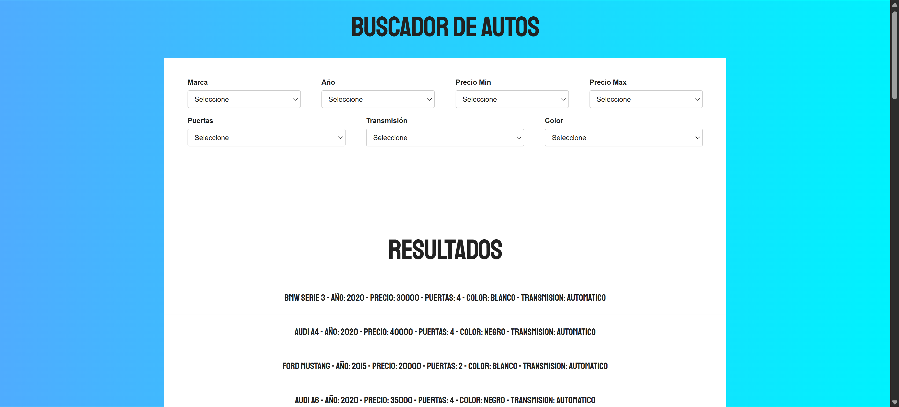
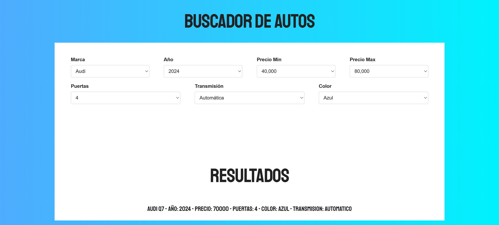
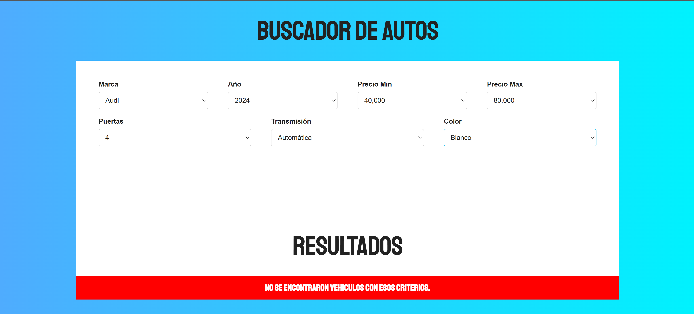

# Car Filter Search

## Live Demo 
[View Live Project](https://car-filter-search.vercel.app/)


## Preview

### Default State


### Filtered Results


### No Results Feedback



## Features

- Real-time filtering with instant results
- Multi-criteria search with up to 7 different filters
- Dynamic year generation (last 10 years)
- Price range filter (min and max)
- No results feedback message
- Clean and responsive interface

## Built With

- JavaScript (ES6+) - filtering logic and DOM manipulation
- HTML5 - semantic structure
- CSS3 (Skeleton Framework) - responsive layout


## How to Run Locally 

1. Clone the repository:
```bash
   git clone https://github.com/siddhartacoder/car-filter-search.git
```
2. Open `index.html` in your browser

That's it! No build process required.

## Project Structure
```
car-filter-search/
├── index.html          # Main HTML file
├── js/
│   ├── filter.js      # Filtering logic
│   └── db.js          # Car database
├── css/
│   ├── app.css        # Custom styles
│   ├── skeleton.css   # Grid framework
│   └── normalize.css  # CSS reset
└── README.md
```

## What I Learned

- Chaining multiple array filter methods
- Real-time filtering without page reload
- Dynamic DOM element generation
- State management with JavaScript objects
- Conditional rendering based on search results
